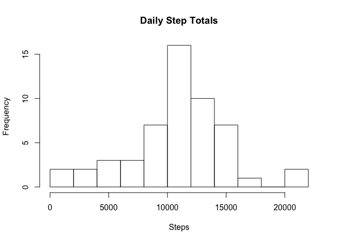
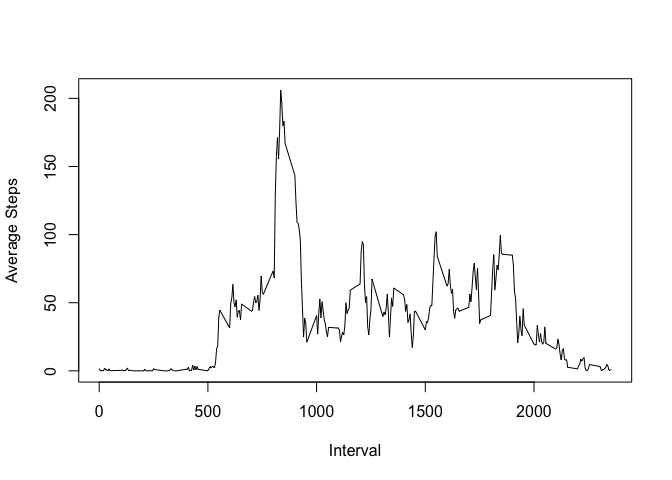
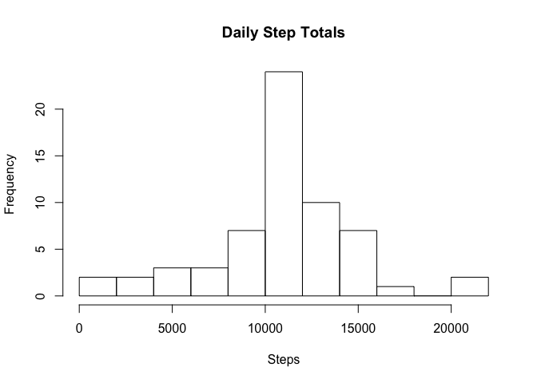
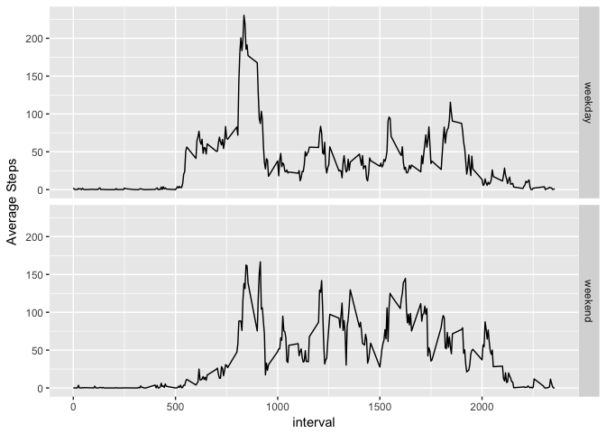

## Loading and preprocessing the data


```r
library(dplyr)
unzip("activity.zip")
df <- read.csv("activity.csv")
```

## What is mean total number of steps taken per day?

```r
date_sum <- df %>% group_by(date) %>% summarize(total = sum(steps))
hist(date_sum$total, breaks = 10, xlab = "Steps", main = "Daily Step Totals")
```

<!-- -->

The mean daily step total is $1.0766189\times 10^{4}$, and the median daily step total is $10765$.

## What is the average daily activity pattern?


```r
int_avg <- df %>% group_by(interval) %>% summarize(mean = mean(steps, na.rm = TRUE))
plot(int_avg$interval, int_avg$mean, type = "l", xlab = "Interval", ylab = "Average Steps")
```

<!-- -->

The interval with maximum average number of steps is 835.

## Imputing missing values

The total number of missing values is 2304.


```r
df2 <- df %>% group_by(interval) %>% 
    mutate(steps = ifelse(is.na(steps), mean(steps, na.rm = TRUE), steps)) %>% ungroup()
date_sum2 <- df2 %>% group_by(date) %>% summarize(total = sum(steps))
hist(date_sum2$total, breaks = 10, xlab = "Steps", main = "Daily Step Totals")
```

<!-- -->

The mean daily step total is $1.0766189\times 10^{4}$, and the median daily step total is $1.0766189\times 10^{4}$. The means before and after imputing missing values are the same. The median was slightly different before and is now the same, but only slightly different. The histogram shows a higher peak around the mean but is otherwise the same.

## Are there differences in activity patterns between weekdays and weekends?


```r
library(ggplot2)
df2$weekend <- ifelse(weekdays(as.Date(df2$date)) %in% c("Saturday", "Sunday"), "weekend", "weekday")
int_avg2 <- df2 %>% group_by(weekend,interval) %>% summarize(mean = mean(steps, na.rm = TRUE))
ggplot(int_avg2, aes(x = interval, y = mean)) + geom_line() + ylab("Average Steps") + facet_grid(weekend ~ .)
```

<!-- -->
